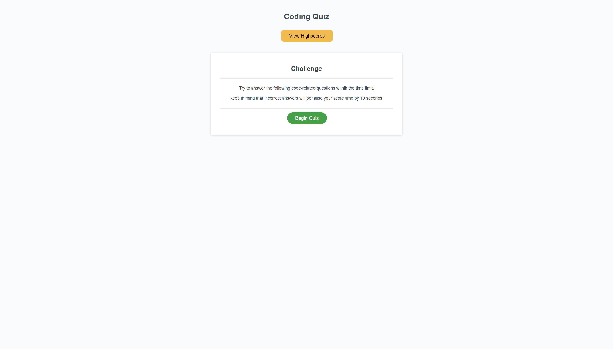
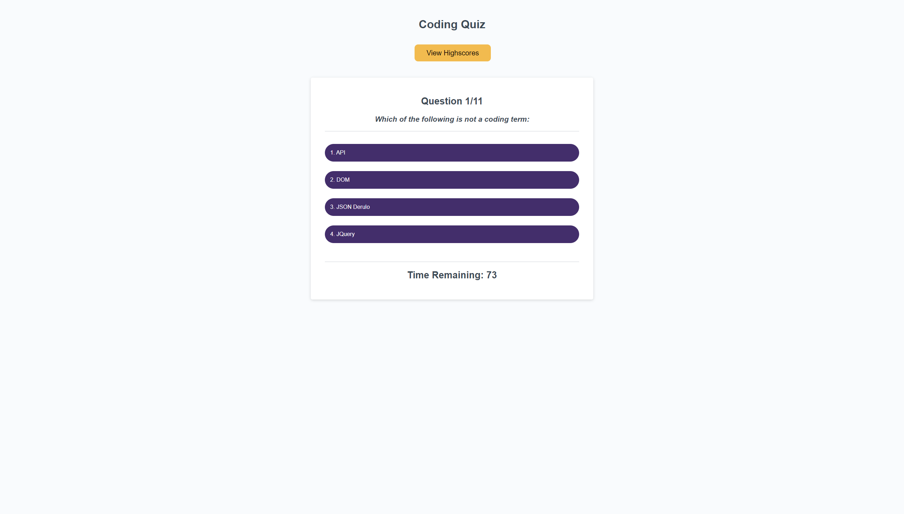
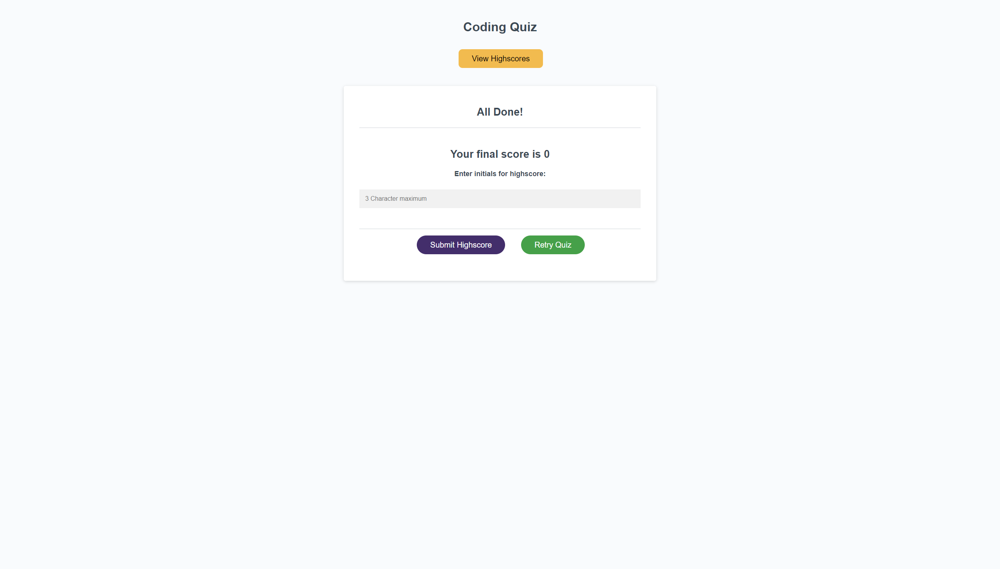
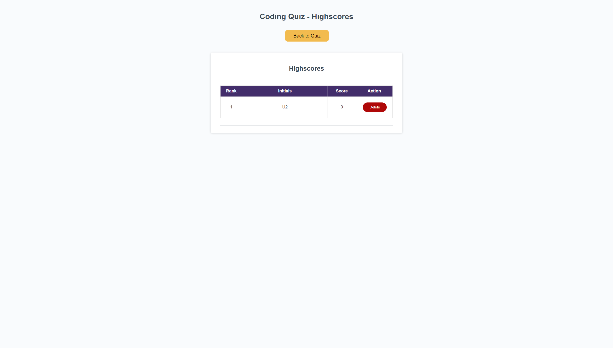

# coding-quiz-jasibal

## Description

A javascript project of a simple quiz. Includes a countdown timer, penalties for incorrect responses and a highscore table generated from local storage.

## Links

[Quiz page](https://vicryt8.github.io/coding-quiz-jasibal/)  
[Highscore page](https://vicryt8.github.io/coding-quiz-jasibal/assets/highscore.html)

## Screenshots

### Quiz Start

### Quiz

### Quiz Finish

### Quiz Highscores

